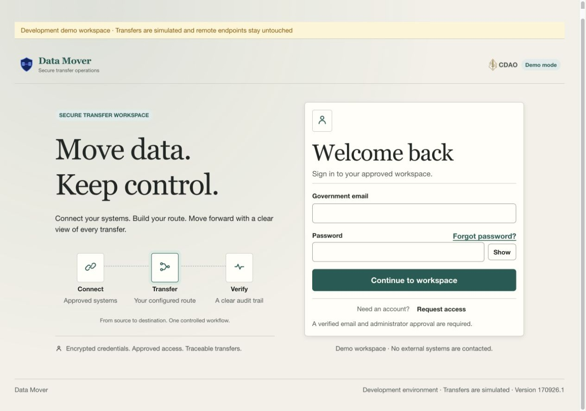
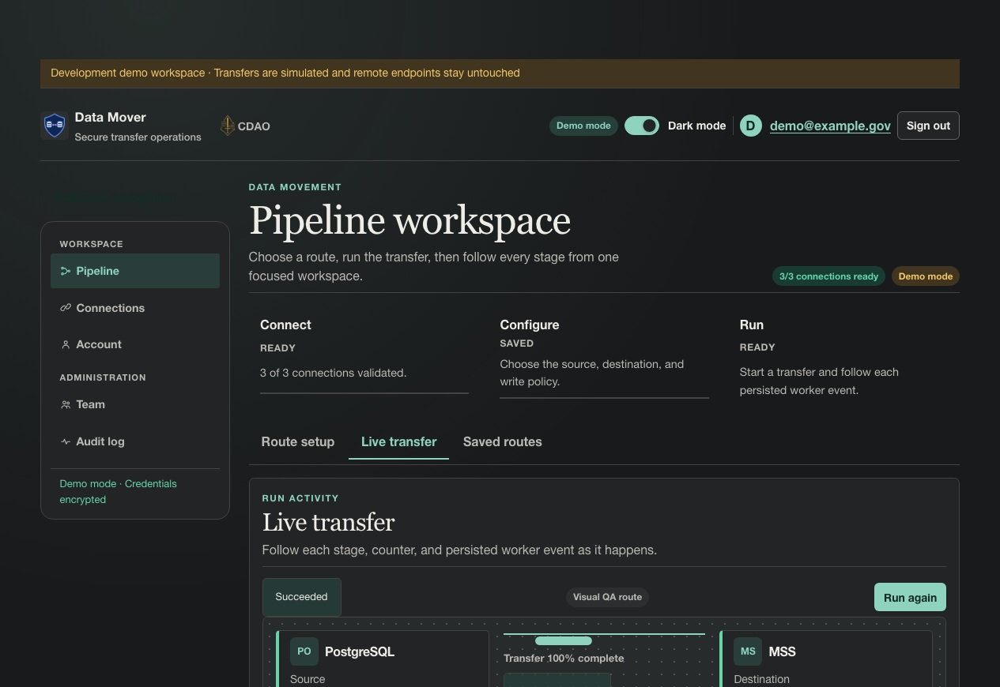
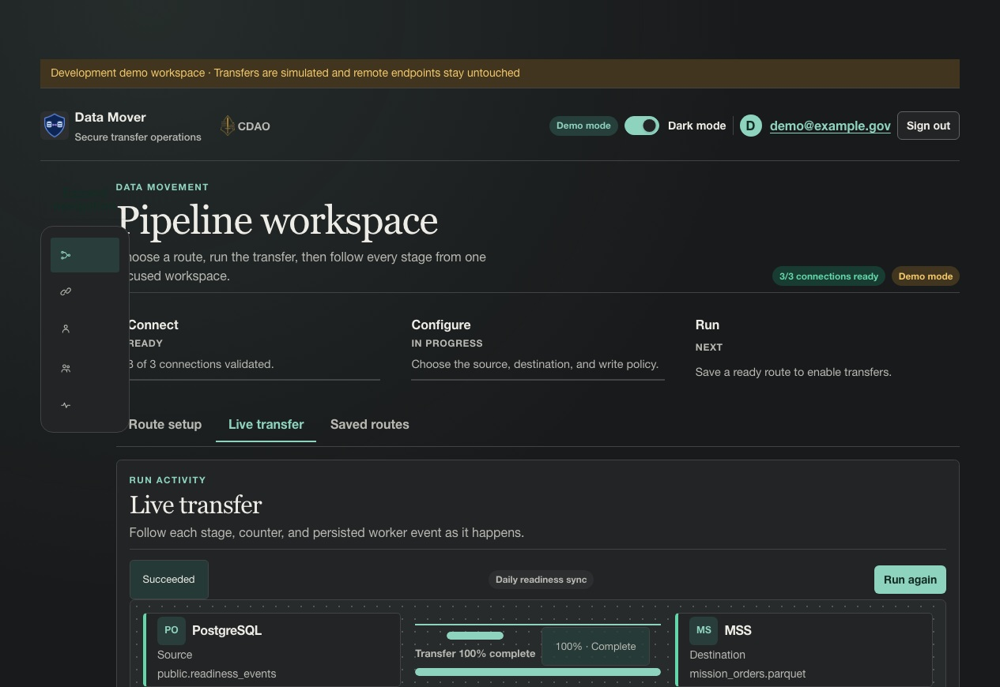
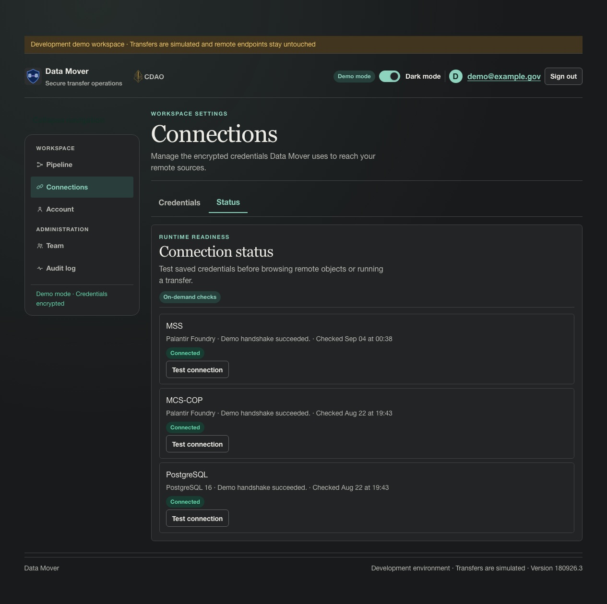
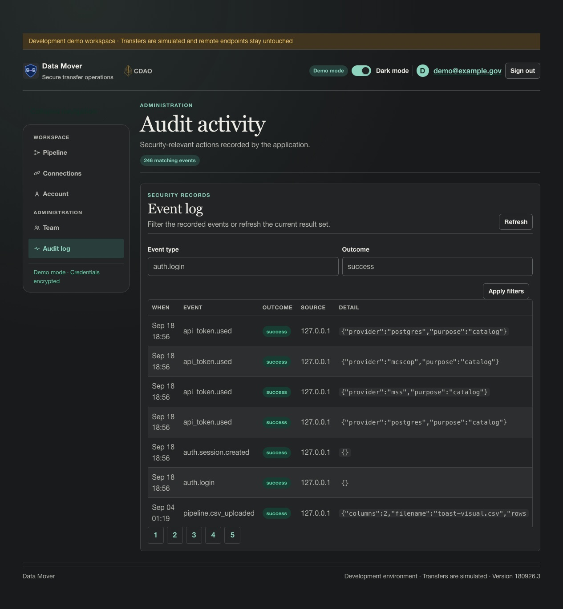

# Data Mover

Data Mover is a self-hosted data-movement application for organizations that want to
configure connections, browse remote objects, save pipelines, and run durable transfers
between MSS, MCS-COP, PostgreSQL, and local CSV files using each user's encrypted credentials.

It is a **browser UI** (FastAPI + [Hedron](https://github.com/eddiethedean/hedron) + HTMX),
**not a public REST API**. Auth is either local passwords or a trusted identity header behind
an approved CAC/MFA proxy. Set `DATA_MOVER_MODE=demo` for offline fake connectors, or
`DATA_MOVER_MODE=real` for live transfers executed by `python -m app pipeline-worker`.
Production refuses demo mode.

This software does **not** by itself constitute an ATO, FedRAMP package, or FIPS validation.
See [SECURITY.md](SECURITY.md).

| | |
|--|--|
| Product name | Data Mover |
| Python package / CLI | `access-registry` (`python -m app`) |
| GitHub repository | `user-token-management-app` |
| ASGI entrypoint | `app.main:app` |
| Default local URL | http://127.0.0.1:8000 |
| Default local DB | `./access-registry.db` (SQLite) |

## What it does

- Saved, user-owned pipelines with provider-accurate locators (schema/table or dataset/branch/file)
- Owner-scoped CSV sources with header discovery and inferred column data types
- Durable pipeline runs with enqueue, cancel, and HTMX polling against persisted events
- Self-registration (email verify → admin approve) or admin invitations
- Local password sign-in **or** trusted-header federated sign-in
- User profile, session list/revoke, and password change
- Encrypted, provider-specific credentials for MSS, MCS-COP, and PostgreSQL
- Connector health checks (fake in demo mode; live in real mode)
- Admin user directory, invitations, approve/deny/disable, audit log
- Asynchronous email delivery built into the web app
- A separate pipeline worker and janitor for transfers, leases, and retention

## Runtime model

The browser process owns authentication, the UI, persistence, audit records, and email delivery.
Email is queued transactionally and drained by a lightweight in-process FastAPI background task:

| Process | Responsibility |
|---|---|
| Web app (`serve`) | Render the UI, validate requests, enqueue runs, and expose `/health` |
| In-process email delivery | Drain verification, invitation, registration, password-reset, and account-security messages after email-producing requests |
| Pipeline worker | Claim leases, execute real transfers, and persist progress/events |
| Pipeline janitor | Retain run history and clean expired events, catalogs, and spool files |

Email delivery does not use a separate worker process. If the web process restarts before a task
finishes, pending rows remain in the outbox; a later email-producing request or `send-email` drains
them, and `retry-email` requeues dead-lettered messages. In demo mode, connectors are fake and stay
local. In real mode, only the separately supervised pipeline worker contacts configured providers.

## Screenshots

These desktop screenshots were captured from the local `make demo` environment. Demo connectors
are simulated, remote endpoints are not contacted, and the images contain no real credentials. The
workflow captures are full-page; the collapsed-navigation view uses a fixed desktop viewport to make
the rail behavior easy to compare. Together they show the shell, navigation, primary content,
controls, status details, and footer.

### Sign in



The sign-in screen introduces the secure transfer workspace before requesting credentials. It keeps
the Data Mover and CDAO identities visible, explains the protections applied to transfers, and
clearly identifies the local environment as a controlled demo.

### Pipeline workspace



The Pipeline workspace combines route setup, saved routes, and live transfer monitoring. The live
view shows the source and destination, transfer progress, stage completion, row/byte counters, and
the persisted event feed that operators can use to understand what happened during a run.

### Collapsed navigation



The desktop rail collapses to the same five route icons used in the expanded navigation. Their
position and active-state treatment remain fixed while only the visible text labels are removed;
accessible link names remain available to assistive technology, and the browser remembers the rail
preference between visits.

### Connection status



The Connection status screen makes readiness explicit. Each provider shows its latest health-check
result and offers an on-demand **Test connection** action; only connections that are saved and
connected are available to Pipeline selectors.

### Audit activity



The administrator Audit activity screen records security-relevant application events with timestamps,
event types, outcomes, sources, and redacted details. Filters make it possible to narrow the event
log during routine review or incident investigation.

## Non-goals

- Not a public JSON/OpenAPI resource API (cookie-session HTMX UI only)
- Not identity proofing, clearance verification, or CAC replacement by itself
- Demo mode does not contact remote endpoints; real mode requires PostgreSQL, a spool directory, and an HTTPS host allowlist
- CSV uploads are limited to UTF-8 files of 5 MB or less until streaming quotas exist
- Not a general-purpose run supervisor for arbitrary workloads (see SD-24)
- Advana and MongoDB are not first-class transfer providers in this release

## Documentation map

| Doc | Audience |
|-----|----------|
| [Quick start](#quick-start) (this README) | New operators |
| [docs/user-guide.md](docs/user-guide.md) | People configuring connections and running pipelines |
| [demo-app/README.md](demo-app/README.md) | Minimal Posit Workbench / Connect confidence check |
| [docs/connect-sqlite-demo.md](docs/connect-sqlite-demo.md) | Full app, disposable Connect demo with SQLite |
| [docs/auth-modes.md](docs/auth-modes.md) | Choosing password vs trusted-header |
| [docs/deploy.md](docs/deploy.md) | Posit Connect / Workbench production |
| [docs/troubleshooting.md](docs/troubleshooting.md) | Common failures |
| [docs/faq.md](docs/faq.md) | Short answers |
| [docs/architecture.md](docs/architecture.md) | Trust boundaries and layout |
| [docs/maintainer-guide.md](docs/maintainer-guide.md) | Developer workflow, extension points, testing, and operations |
| [docs/runbooks/pipeline-worker.md](docs/runbooks/pipeline-worker.md) | Web + worker operations |
| [docs/providers/mss.md](docs/providers/mss.md) | Frozen Foundry/Postgres protocol notes |
| [docs/hedron.md](docs/hedron.md) | Hedron integration and feature coverage |
| [docs/plans/README.md](docs/plans/README.md) | Roadmap artifacts, ETL/security contracts, ADE learning path, and delivery evidence |
| [examples/no_node_data_app/README.md](examples/no_node_data_app/README.md) | Runnable FastAPI + Hedron + HTMX example without Node.js or Streamlit |
| [SECURITY.md](SECURITY.md) | Decision register + production gate |
| [CONTRIBUTING.md](CONTRIBUTING.md) | Development and UI contributions |
| [CHANGELOG.md](CHANGELOG.md) | Release notes |

## Prerequisites

- **Python 3.11+** (CI runs 3.11; 3.12/3.13 should work)
- Network access to install dependencies from PyPI
- **Development:** SQLite (default)
- **Production:** PostgreSQL (`postgresql+psycopg://…`), HTTPS, SMTP — see [docs/deploy.md](docs/deploy.md)

If you want to validate Posit Workbench and Connect before configuring the full application, start
with the dependency-light [demo app](demo-app/README.md).

## Quick start

```bash
python3 -m venv .venv
source .venv/bin/activate   # Windows: .venv\Scripts\activate
python -m pip install -e ".[dev]"
cp .env.example .env
# Edit .env if needed; local defaults work with console email.
python -m app migrate
ADMIN_BOOTSTRAP_PASSWORD='Your-Long-Password-15+' python -m app create-admin \
  --email admin@example.gov --password-env ADMIN_BOOTSTRAP_PASSWORD
python -m app serve --reload
```

Open http://127.0.0.1:8000/login and sign in with the admin email and password.

**Password rules (local_password):** 15–128 characters after Unicode NFC normalization;
must not contain the email local-part; optional offline blocklist in production.

**Interactive admin create** (no env var): `python -m app create-admin --email admin@example.gov`
(prompts for password). The same command **promotes** an existing user to administrator.

Email delivery starts automatically with the app when an email-producing request completes. With
`EMAIL_BACKEND=console`, verification and reset links print to the app log. There is no separate
email worker to start; `send-email` remains available for one-shot recovery and `retry-email`
requeues dead letters.

## Explore the demo

For a one-command local demo with a dedicated account and fake credentials for the three provider
connections:

```bash
make demo
```

Open the URL printed by the script and use its email/password. On a local machine this is
`http://127.0.0.1:8765/login`; in Workbench the launcher asks `rserver-url` for the exact session URL
for port 8765 and configures Hedron with the same mount. Do not reuse a session URL created for port
8000. The script migrates a local SQLite database, creates the demo administrator, stores encrypted
values under reserved `.demo.invalid` hosts, and starts Data Mover. These values are intentionally
fake and the seeding command refuses to run in production.

After signing in:

1. Open **Connections → Credentials** and review the seeded MSS, MCS-COP, and PostgreSQL
   connections. Every value is encrypted, and the saved plaintext is never displayed again.
2. Open **Connections → Status** and select **Test connection**.
3. Open **Pipeline → Route setup** and choose existing source and destination objects from the
   demo catalogs. Only connections you have saved and validated appear. CSV files may also be
   uploaded, scanned, and used as sources.
4. Select a write mode, save the route, and run it. Use **Live transfer** to follow persisted run
   events and **Saved routes** to load a reusable pipeline.

Demo mode does not contact remote systems. Use only non-sensitive test values and data. The complete
workflow is in the [Data Mover user guide](docs/user-guide.md).

## CLI reference

All of these are available as `python -m app …` or `access-registry …`.

| Command | Purpose |
|---------|---------|
| `migrate` | Upgrade schema to Alembic head |
| `migrate --adopt-existing` | Stamp a verified pre-Alembic DB, then upgrade |
| `schema-status` | Show current vs expected revision |
| `create-admin --email …` | Create or promote an administrator |
| `create-admin … --password-env VAR` | Non-interactive password from env |
| `seed-demo-connections --email … [--replace]` | Add fake encrypted credentials to a development account; refused in production |
| `serve [--host] [--port] [--reload]` | Local / Workbench-aware server |
| `send-email` | One-shot drain of queued email (manual recovery) |
| `retry-email [--message-id ID] [--limit N]` | Requeue dead-lettered messages |
| `pipeline-worker [--once]` | Claim and execute queued pipeline runs |
| `pipeline-janitor` | Purge expired runs, events, catalog cache, and spool files |

Schema must be current before `create-admin` or `serve` (startup checks).

## Make targets

| Target | Action |
|--------|--------|
| `make install` | `pip install -e ".[dev]"` |
| `make migrate` | `python -m app migrate` |
| `make schema-status` | Show Alembic revisions |
| `make serve` | `python -m app serve --reload` |
| `make demo` | Create/refresh a local demo account, seed three fake provider connections, and serve on port 8765 |
| `make create-admin` | Uses `ADMIN_EMAIL` (default `admin@example.gov`); set `ADMIN_BOOTSTRAP_PASSWORD` for non-interactive local mode |
| `make pipeline-worker` | Run the pipeline worker |
| `make pipeline-janitor` | Run pipeline retention and cleanup |
| `make check` | ruff + basedpyright + pytest (80% coverage gate) |
| `make hedron-check` | Validate Hedron routes and interaction contracts |
| `make hedron-build` | Build the production Hedron asset manifest |
| `make workbench-up` | Start licensed Posit Workbench + app Docker stack (needs `POSIT_WORKBENCH_KEY`) |
| `make workbench-test` | Opt-in Workbench Docker integration tests |
| `make workbench-down` | Graceful stop (important for license-key deactivation) |

## Configuration

Copy [.env.example](.env.example) for secrets and deployment-specific overrides. Stable local
defaults are committed in `app/config.py`; the purpose of every setting is documented in
[docs/configuration.md](docs/configuration.md).
Auth modes: [docs/auth-modes.md](docs/auth-modes.md).

Production refuses insecure settings (HTTPS `PUBLIC_BASE_URL`, `COOKIE_SECURE`, Postgres,
SMTP, rate limits, and more). Checklist: [SECURITY.md — Production security gate](SECURITY.md#production-security-gate).

## Posit Workbench and Connect

For a disposable evaluation of the full app, use the dedicated
[Connect SQLite demo guide](docs/connect-sqlite-demo.md). The full
[step-by-step Posit guide](docs/deploy.md) covers the local and operational Workbench paths, the
SQLite Connect evaluation, and production Connect deployment. It includes Python 3.11 setup,
installation, configuration, migrations, administrator bootstrap, Workbench session URLs,
production secrets, SMTP invitations, directory email checks, Hedron assets, `.env`-driven Connect
publishing, in-process email delivery, the
pipeline worker and janitor, and verification. Connect 2025.06.0
and 2026.07 have both passed licensed, proxy-free application-cookie acceptance tests. Access
Data Mover keeps its own users and sessions rather than treating Connect identity as application
identity.

Workbench demo setup is one command after the shared install:

```bash
source .venv/bin/activate
make demo
```

Workbench email configuration (the root `.env`, console versus SMTP, and in-process delivery) is
documented in [the deployment guide](docs/deploy.md#configure-env-and-email).

The seed step is development-only, preserves existing connection bundles by default, and makes the
three demo providers immediately available on Pipeline. The disposable Connect SQLite guide
uses the same step before bundling its database; production Connect explicitly omits it.

For live connector checks, transfers, and SMTP invitations from Workbench, follow the
[operational Workbench deployment](docs/deploy.md#operational-workbench-deployment). That path
supports session-scoped SQLite/live operation for one operator or PostgreSQL/live operation when
the database and provider access are approved. Its commands are:

```bash
scripts/run-workbench.sh migrate
scripts/run-workbench.sh admin --email admin@example.gov
scripts/run-workbench.sh web
scripts/run-workbench.sh worker   # separate terminal
scripts/run-workbench.sh janitor  # optional daily cleanup
```

Optional local regression against a real Workbench image (put a trial key in `.env` only —
never commit it):

```bash
# POSIT_WORKBENCH_KEY=… in .env
make workbench-up
make workbench-test
make workbench-down
```

Details: [docker/README.md](docker/README.md).

The SQLite Connect path is a single-process, disposable demo whose data resets on redeployment. Do
not promote that configuration to production. The production path requires PostgreSQL, SMTP, strong
secrets, secure cookies, a password blocklist, migrations before startup, a Hedron build, a
protected pipeline spool directory, and separately supervised pipeline-worker and janitor services.
Follow every production Connect step in the deployment guide before publishing
`app.main:app` for operational use.

## Contributing

See [CONTRIBUTING.md](CONTRIBUTING.md) for setup, tests, and how to add an HTMX page.

## License

[MIT](LICENSE)
