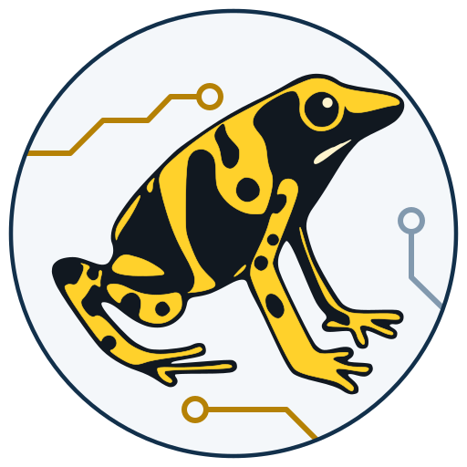

# Data Mover frog assets

Editable yellow-banded poison dart frog artwork reconstructed from the flat logo-system preview. All four source SVGs contain actual vector paths, with no embedded PNGs, scripts, fonts, external images, or network dependencies. The earlier glossy concept is not the vector master.

This is an additive asset kit. The existing Data Mover/CDAO assets and application UI are unchanged.

## Source assets

| File | Purpose |
| --- | --- |
| `frog.svg` | Circular badge; automatic theme and optical detail |
| `app-icon.svg` | Rounded-square app icon; automatic theme and optical detail |
| `favicon.svg` | Dedicated simplified head glyph, at every display size |
| `frog-mark.svg` | Transparent full-body artwork for editing and larger placements |

The first three files support automatic color-scheme selection and explicit URL-fragment overrides. These are self-contained SVG documents, not wrappers around another file.

| Mode | Circular badge | App icon | Favicon |
| --- | --- | --- | --- |
| Automatic | `frog.svg` | `app-icon.svg` | `favicon.svg` |
| Light | `frog.svg#light` | `app-icon.svg#light` | `favicon.svg#light` |
| Dark | `frog.svg#dark` | `app-icon.svg#dark` | `favicon.svg#dark` |

The transparent `frog-mark.svg` retains its yellow/black colors and has no theme or optical-size switching.

## Optical sizes

For `frog.svg` and `app-icon.svg`, the SVG viewport width selects the artwork:

| Rendered width | Artwork |
| --- | --- |
| 64 px and larger | Full frog with circuit details |
| 32-63 px | Full frog without circuit details |
| 16-31 px | Simplified head and broader border |

Use these responsive documents as external images, such as `` sources. When SVG is pasted inline, media queries follow the containing document's viewport, not the SVG element's width. Use a fixed-detail export for inline placement. Preserve the square aspect ratio; sizes below 16 px are not targeted.

## HTML usage

The paths below are relative to this asset folder. In application code, generate the correct static URL using the existing asset/URL helper, including any deployment prefix. Do not assume the app is hosted at `/`.

```html
<!-- Automatic theme and optical size. -->


<!-- Explicit app theme, independent of the operating-system preference. -->


<!-- The dedicated favicon always uses the simplified glyph. -->
<link rel="icon" type="image/svg+xml" href="favicon.svg">
```

Use `alt=""` for a purely decorative logo beside an already-announced app name. For manual theme toggles, switch the fragment between `#light` and `#dark`. The default theme is light in renderers that do not support `prefers-color-scheme`.

`preview.html` displays both themes and actual pixel sizes. Theme overrides and size switching were visually checked in Chromium as embedded SVG images. Test the intended browsers and the application's content-security policy before integrating; this asset change does not change security settings.

## Fixed SVG, PNG, and ICO exports

From the repository root:

```sh
# Standard-library-only: 14 fixed-theme/fixed-detail SVGs.
python scripts/export_frog_assets.py

# Optional export environment; these are not app runtime dependencies.
python -m pip install CairoSVG Pillow
python scripts/export_frog_assets.py --png

# Isolated asset checks; no application or database startup.
python scripts/test_frog_assets.py
```

The default output is `app/static/brand/frog/exports/`. Pass `--output /your/path` to choose another folder. Exporting overwrites only the deterministic filenames it generates; it does not delete other files.

Fixed SVG filenames include `frog-dark-primary.svg`, `frog-light-compact.svg`, `app-icon-dark-micro.svg`, and `favicon-light.svg`. These exports resolve theme/detail into presentation attributes and do not rely on CSS media queries or URL fragments, making them suitable for inline SVG, design tools, and raster conversion.

`--png` creates **66 files total**: 14 fixed SVGs, 48 PNGs, two multi-resolution ICOs, and two example icon manifests. PNG sizes are 16, 24, 32, 48, 64, 96, 128, 180, 192, 256, 512, and 1024 pixels for both badge shapes and both themes. Every ICO contains the simplified glyph at 16, 32, and 48 pixels.

The manifests are examples generated beside their referenced PNGs; they are not linked into the app. They do not configure a start URL, scope, or service worker. Rounded icons have `purpose: "any"`; they are not claimed to satisfy platform-specific maskable/adaptive-icon or app-store requirements.

Vector sources and the exporter are the checked-in assets. Fixed exports, raster exports, and the original raster concept/reference sheets are distributed separately in the accompanying asset archive; run the exporter to regenerate production derivatives. No new application dependency is introduced by this kit.

## Palette

| Token | Value |
| --- | --- |
| Frog yellow | `#FFD12B` |
| Frog black | `#111820` |
| Highlight | `#FFF4CD` |
| Light surface / border | `#F4F7FA` / `#12304B` |
| Dark surface / border | `#081F34` / `#FFD12B` |
| Light / dark circuit accent | `#B58105` / `#FFD12B` |
| Light / dark secondary accent | `#8299AE` / `#52758F` |

Keep the black markings and pale eye highlight. Prefer the micro glyph rather than shrinking full-body artwork below 32 px. Use the existing repository's licensing terms; this asset kit does not introduce a different license.
