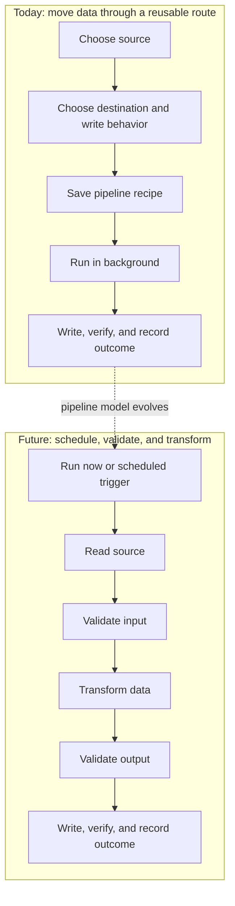
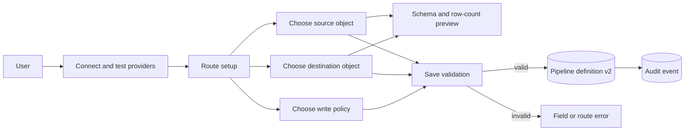
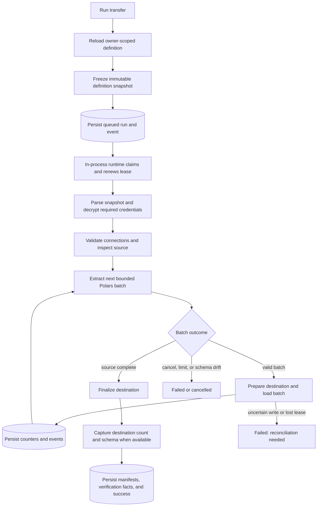
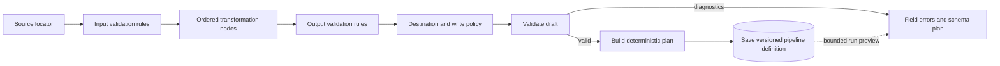
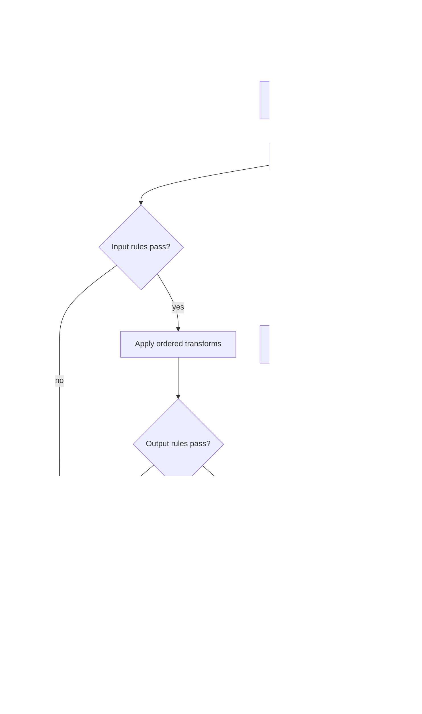
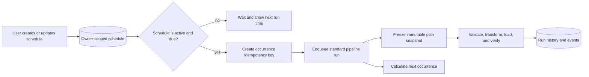

# Data pipeline lifecycle

This document explains how Data Mover creates and runs pipelines today, then describes the intended
extension points for scheduling, data validation, and transformations. The future-state sections
are an architectural direction, not a claim that those features are available.

For user instructions, see the [Data Mover user guide](user-guide.md). For runtime recovery and
reconciliation procedures, see the [pipeline runtime runbook](runbooks/pipeline-worker.md).

## High-level view

Think of a **pipeline definition** as a reusable recipe and a **pipeline run** as one recorded use of
that recipe. The definition says where data comes from, where it goes, and how the destination
should be written. A run takes a fixed snapshot of that definition, moves the data in the
background, and records what happened without storing credentials in the recipe.

Today, Data Mover is focused on controlled movement: select a source and destination, save the
route, run it manually, and verify the result. The future design adds scheduling and governed
processing: start the pipeline now or on an owner-defined schedule, validate incoming data, apply an
ordered set of transformations, validate the result, and only then write it to the destination.

The core safety model stays the same in both versions: definitions and runs belong to a user,
credentials are resolved only within an explicit owner-authorized connector action, every run uses
an immutable snapshot, and the application persists status and sanitized evidence for monitoring
and review.

## What a pipeline means today

A current Data Mover pipeline is a reusable, owner-scoped **extract-and-load route**. It identifies
one source selection, one destination object, and one destination write policy. It is not currently
a general directed graph and it does not contain user-authored transformation or data-quality nodes.

The saved definition contains:

- a display name and owner;
- source and destination provider IDs;
- versioned, provider-specific locators, such as a PostgreSQL table, Foundry dataset file, or CSV
  upload and checksum; and
- a typed write policy, such as PostgreSQL append, upsert, or replace, or Foundry file replace.

Credentials are deliberately absent. The definition refers to the owner's provider slots, and the
runtime decrypts the necessary credential bundles only after it claims a run. The separate catalog
and connection-test actions may also decrypt the signed-in owner's selected bundle for that bounded
request; no plaintext credential is written to the definition, run snapshot, catalog cache, or UI.

## Current state: creating a pipeline

The browser builds a route from connector capabilities, configured provider slots, and owner-scoped
catalogs. Saving a route that uses a remote provider requires that provider's most recent connection
test to have succeeded. CSV is a source-only option; its upload is scanned and stored before the
route can be saved.

The product-approved route matrix is intentionally narrower than the cross-product of connector
capabilities:

| Source | Approved destinations |
|---|---|
| MSS | PostgreSQL |
| PostgreSQL | MSS, MCS-COP |
| CSV upload | PostgreSQL, MSS, MCS-COP |

MCS-COP is destination-only. A destination also remains unavailable unless its writer flag is
enabled (`PIPELINE_ENABLE_POSTGRES_WRITER`, `PIPELINE_ENABLE_MSS_WRITER`, or
`PIPELINE_ENABLE_MCSCOP_WRITER`). The UI filters the choices, and save/enqueue/runtime boundaries
repeat the same checks.

In real mode, catalog discovery calls the provider connector with the signed-in owner's decrypted
credential. Namespace and object results are reduced to credential-free metadata and cached by
user/provider/namespace for `PIPELINE_CATALOG_TTL_SECONDS` (300 seconds by default). Replacing or
deleting that provider credential invalidates its cache. Schema inspection and row counts are live,
best-effort connector calls rather than persisted row samples.

When **Save pipeline** is selected, the server does not trust the browser's presentation state. It
normalizes and validates the submitted route, including:

1. pipeline name and authenticated owner;
2. supported source-to-destination pairing from the connector registry;
3. a connected credential slot for each remote provider;
4. ownership and checksum metadata for a CSV upload, when used;
5. provider-specific locator syntax and destination naming; and
6. a write policy supported by the destination.

The service then creates or updates an owner-scoped `pipeline_definitions` row and records a
sanitized `pipeline.created` or `pipeline.updated` audit event. Schema and row-count previews help
the user review a route, but the current saved contract is the locator and write-policy JSON—not a
frozen copy of previewed records.

## Current state: running a pipeline

Starting a run and executing the transfer are separate transactions. The request reloads the saved
definition with an ownership check, converts it to a typed, immutable snapshot, creates a durable
queued run, and returns. A response-attached task normally starts the run promptly; the in-process
supervisor also recovers queued or expired work after a restart.

The persisted run snapshot isolates a run from later edits to the reusable definition. Run events,
status, row and byte counters, manifests, and sanitized failures remain in the application database;
the browser only polls those persisted facts.

### Execution stages

| Status | What Data Mover currently does |
|---|---|
| `queued` | Persist the snapshot and wait for the app runtime to claim a lease. |
| `validating` | Parse the snapshot, resolve the owner's credentials, test both connections, inspect the source schema, and collect best-effort destination metadata. |
| `extracting` | Open the source iterator and read Polars batches bounded by both configured rows and estimated in-memory bytes. A single row larger than the byte ceiling fails explicitly. The first batch can supply portable schema metadata. |
| `loading` | Prepare the destination, enforce run size/time limits and stable batch columns, write each batch, and persist acknowledged counters. |
| `verifying` | Finalize the destination and capture provider-appropriate manifests, counts, checksums, remote IDs, and schema metadata when available. |
| terminal | Persist `succeeded`, `failed`, `cancelled`, or `failed_needs_reconciliation` and release the lease. |

The worker renews its lease approximately every one-third of the configured lease duration from a
dedicated database session. Every lease-guarded state/counter mutation refreshes the run and verifies
the token and unexpired timestamp in the database, so a stale worker cannot continue based on an
in-memory object. Cancellation is checked at safe boundaries. An expired lease before destination
writes can be requeued; a lost lease during load or verification is treated as an uncertain
destination and requires reconciliation rather than a blind retry.

PostgreSQL replacement keeps destination preparation, staged COPY, and the final drop/rename in one
database transaction. Until finalization commits, the live destination remains intact; abort or a
closed/crashed connection rolls the staging work back. After any connector reports a successful
destination commit, a later failure to persist final run state is converted to `publish_uncertain`
and requires reconciliation. Foundry timeouts during the preview upload use the same conservative
outcome because the remote publish result cannot be proven.

### What “validation” means today

Data Mover already validates several kinds of control-plane and transfer metadata, but it does not
yet execute user-defined data-quality rules:

| Current check | When | Purpose |
|---|---|---|
| Credential field validation and connection test | Connection setup | Confirm that a credential bundle is well formed and can reach its provider. |
| Route, capability, locator, ownership, and write-policy validation | Save | Prevent unsupported or cross-owner definitions. |
| Connection retest and source inspection | Run, before extraction | Fail before writes when the route can no longer be opened safely. |
| Batch column-set and row/byte limit checks | During extraction/load | Detect column drift and enforce bounded execution, including rejecting one indivisible oversized row. |
| Destination finalization and manifest capture | After load | Record provider-appropriate evidence about what the destination acknowledged. |

The current system does **not** provide rules such as “`event_id` must be unique,” “reject null
timestamps,” “amount must be non-negative,” or “quarantine invalid rows.” Verification telemetry
also must not be interpreted as a universal row-by-row reconciliation guarantee; connector
capabilities determine what can be observed.

## Future state: validation and transformation

The intended evolution is to extend the saved route into a versioned, deterministic execution plan.
Source, validation, transformation, and destination steps become explicit nodes with typed inputs and
outputs. The definition continues to contain references to owner-scoped secrets, never plaintext
credential values.

### Future authoring flow

Authoring should follow the adapter boundary already described in the
[ETL Pipeline Framework integration note](plans/etl-integration-note.md):

1. `validate` normalizes the draft and returns field-level diagnostics without network side effects;
2. `plan` produces a deterministic graph, expected schemas, and resource requirements without
   plaintext secrets; and
3. the saved pipeline records the normalized plan version, ordered nodes, validation policies, and
   any schema contracts needed to reproduce a run.

A separate, bounded preview action can execute the saved or draft plan against owner-authorized
source data. Keeping preview execution separate preserves the side-effect-free `validate` and `plan`
contract and makes preview resource limits and redaction visible to the user.

Initial transformation nodes should be bounded and allowlisted—for example select/drop/rename,
explicit type casts, normalized values, derived expressions, filters, and deduplication. SQL or
PySpark-backed nodes remain gated on a supported framework release, dialect/runtime contracts,
resource limits, and sandboxing. Arbitrary user code should not be accepted as a shortcut.

Validation rules should be explicit about their evaluation point and outcome. Likely rule families
include schema contracts, required values, accepted ranges or sets, uniqueness, and aggregate row
expectations. The first safe behavior for an error-level rule is to stop before destination writes;
warning thresholds and quarantine destinations need separate, deliberate contracts so that a run
cannot silently discard or redirect records.

### Future execution flow

Every run will need to snapshot the exact plan and rule versions so an edit cannot change work that
is queued or in progress. Transformations must preserve bounded-batch execution unless a node
declares and receives resources for a full-run operation. Diagnostics may identify a rule, column,
batch, and count, but must not copy sensitive cell values into events, logs, or audit records.

The run state machine will also need explicit planning, transformation, and data-validation states
or equivalent substage events. Failures before destination writes can remain safely retryable after
the definition or source is corrected. Failures after writes begin must keep the current
reconciliation safety behavior unless the destination adapter proves an atomic rollback.

## Future state: scheduling

Data Mover currently starts pipelines only through a user action; its background supervisor recovers
queued work but is not a calendar scheduler. Future scheduling should add an owner-scoped trigger in
front of the existing enqueue boundary rather than create a second execution path.

A schedule should identify a user-owned pipeline, cadence, timezone, enabled or paused state, and
next occurrence. When an occurrence is due, a scheduling coordinator should call the same enqueue
service used by **Run transfer**. The resulting run receives a unique occurrence key for duplicate
suppression and follows the normal lease, cancellation, validation, transformation, verification,
and reconciliation rules. The schedule never stores credentials and never treats enqueue as proof
that the transfer succeeded.

The scheduling experience should include:

- create, edit, pause, resume, and delete actions with owner authorization and audit events;
- a timezone-aware cadence and a preview of the next run time, including daylight-saving behavior;
- one durable run record and idempotency key per scheduled occurrence;
- an explicit overlap policy when a prior occurrence is still active;
- visible missed, queued, running, failed, and completed occurrences; and
- restart recovery that evaluates due occurrences without silently creating duplicates.

Editing a reusable pipeline must not change a run already queued or in progress. Before
implementation, the product must decide whether future occurrences always use the latest approved
definition or whether a schedule can pin a particular definition version. Pausing or deleting a
schedule should stop new occurrences without changing runs that were already enqueued.

This design expands the acceptance criteria recorded under **DM-6 — schedule and manage** in the
[pipeline delivery record](plans/pipeline-delivery-record.md).

## Current and future boundary

| Area | Current | Future direction |
|---|---|---|
| Trigger | Manual **Run transfer** action | Manual action or owner-defined, timezone-aware schedule |
| Definition shape | One source locator, one destination locator, one write policy | Versioned graph with validation and transformation nodes |
| Data path | Extract bounded Polars batch, then load it | Extract, validate, transform, validate, then load |
| Data validation | Schema continuity, limits, and provider metadata | User-defined schema, row, and aggregate rules with explicit outcomes |
| Transformations | None | Ordered, typed, allowlisted operations; optional framework-backed engines after approval |
| Preview | Source/destination schema and available row counts | Schema propagation, sampled results, rule diagnostics, and remediation |
| Observability | Run stages, events, counters, manifests, sanitized errors | Per-node timing and counts plus redacted rule/transform diagnostics |
| Reproducibility | Immutable locator/write-policy snapshot per run | Immutable plan, node, rule, and engine-version snapshot per run |

## Decisions required before implementation

The future diagrams establish boundaries, not every product policy. Implementation still requires:

- selection and approval of an ETL framework package/version and supported extras;
- a versioning and migration contract for existing version 2 definitions;
- a precise transformation allowlist, expression syntax, and schema-propagation rules;
- validation severity, threshold, sampling, and eventual quarantine semantics;
- deterministic behavior and resource limits for operations such as sort, join, and deduplication;
- safe preview limits and redaction rules;
- schedule ownership, timezone, overlap, missed-run, and definition-version policies; and
- acceptance tests for retries, cancellation, lease recovery, scheduled-run deduplication, partial
  writes, and rule diagnostics.

Until those gates are resolved, the existing connector transfer remains the production path. See
the [SQL and PySpark capability matrix](plans/etl-capability-matrix.md) for the current integration
gaps.

## Implementation map

The current behavior described above is owned primarily by:

- [`app/ui/routes/pipeline.py`](../app/ui/routes/pipeline.py) — builder, save/run actions, and live
  monitor;
- [`app/services/pipelines.py`](../app/services/pipelines.py) — definition validation and
  persistence;
- [`app/services/pipeline_runs.py`](../app/services/pipeline_runs.py) — snapshots, durable states,
  leases, events, and reconciliation;
- [`app/services/pipeline_tasks.py`](../app/services/pipeline_tasks.py) and
  [`app/worker.py`](../app/worker.py) — in-process task dispatch, claiming, credential resolution,
  and recovery; and
- [`app/services/transfer_engine.py`](../app/services/transfer_engine.py) — bounded extract/load and
  finalization orchestration.
