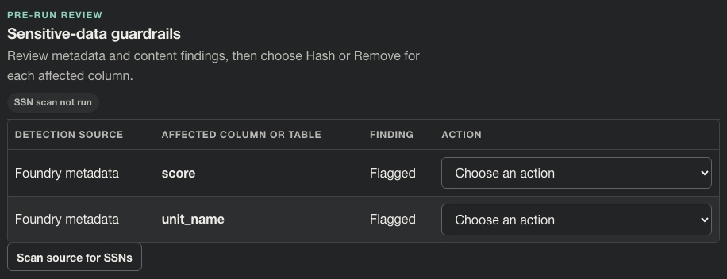

# Story CDO-4552: Identify sensitive Foundry metadata

[Jira CDO-4552](https://idstjira.socom.mil/jira/browse/CDO-4552) · [Epic CDO-4551: Sensitive Data Guardrails](CDO-4551-sensitive-data-guardrails-epic.md) · [Issue export](../../artifacts/jira/data-mover-sensitive-data-guardrails-issues.csv)

## User story

As a pipeline owner, I want Data Mover to identify sensitivity tags in Foundry metadata so I can review sensitive tables and columns before transfer.

## What the story delivers

When Data Mover inspects a Foundry source, it checks its resource and column metadata for configured sensitivity markers. A finding says whether the marker applies to the table or to a column, names the affected object, and identifies Foundry metadata as the detection source. The review uses schema and marker names only; it does not display source cell values.

The default configured markers are sensitive, pii, phi, ssn, cui, confidential, and restricted. Operators can configure the list. Matching normalizes case and punctuation, and only configured marker names are returned from the connector.

## Implementation

The Foundry connector reads dataset resource markings and schema column markings alongside schema inspection. It follows every resource-marking page before reporting a result and returns table-level and column-level markers in the source schema object. The catalog layer refreshes live markings when it reuses a cached schema, clears any old example values, and preserves the original cache expiry. The pre-run review combines markers from both the schema and the column marker map so the same finding is not duplicated.

Sensitivity metadata is fail-closed: a missing schema, malformed response, inaccessible resource-marking list, or unresolved marking name is an unavailable-source error. Data Mover does not treat an unknown result as a verified source with no markers. Configure a token with access to both the dataset schema and its resource markings before running a Foundry transfer.

The review labels each finding “Foundry metadata” and shows the affected table or column. A table-level finding is presented as a block; a column finding receives a Hash/Remove control in the related [action story](CDO-4559-choose-actions-for-metadata-tagged-columns.md).

## Example

For a synthetic Foundry dataset with a configured pii marker on unit_name, the review shows:

| Detection source | Affected column | Finding |
| --- | --- | --- |
| Foundry metadata | unit_name | Flagged |

The row does not include the value held in unit_name. A marker on the dataset itself instead appears as a table-level finding and blocks the source.

## Screenshot

The demo uses an injected synthetic pii marker to show the review behavior; it is not connected to a live Foundry environment.

## Acceptance criteria and implementation

- Configured Foundry markers are normalized and matched in [guardrails.py](../../app/domain/pipelines/guardrails.py) and [foundry.py](../../app/connectors/foundry.py).
- Table and column markers are carried by the source schema and rendered separately in [pipeline.py](../../app/ui/routes/pipeline.py).
- Findings expose marker source and affected name, not cell values. Catalog schema cache examples are cleared in [catalogs.py](../../app/services/catalogs.py).
- The Foundry reader rejects unavailable or malformed sensitivity responses and follows resource-marking pagination in [foundry.py](../../app/connectors/foundry.py).

## Related implementation

[Foundry connector](../../app/connectors/foundry.py) · [Catalog service](../../app/services/catalogs.py) · [Guardrail domain](../../app/domain/pipelines/guardrails.py) · [Pre-run review](../../app/ui/routes/pipeline.py)

## Related Jira tasks

- [CDO task CDO-4553: Data Mover: Map Foundry sensitivity metadata](https://idstjira.socom.mil/jira/browse/CDO-4553)
- [CDO task CDO-4554: Data Mover: Read sensitivity markers from Foundry](https://idstjira.socom.mil/jira/browse/CDO-4554)
- [CDO task CDO-4555: Data Mover: Show Foundry metadata findings in pipeline review](https://idstjira.socom.mil/jira/browse/CDO-4555)
