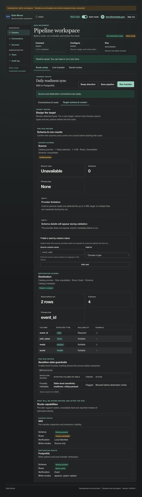

# Story CDO-4556: Block tables marked sensitive

[Jira CDO-4556](https://idstjira.socom.mil/jira/browse/CDO-4556) · [Epic CDO-4551: Sensitive Data Guardrails](CDO-4551-sensitive-data-guardrails-epic.md) · [Issue export](../../artifacts/jira/data-mover-sensitive-data-guardrails-issues.csv)

## User story

As a pipeline owner, I want Data Mover to block a table marked sensitive in Foundry metadata so that the table cannot be transferred.

## What the story delivers

A configured table-level Foundry sensitivity marker blocks the selected source. The pre-run review explains that the table-level marker caused the block, and the scan control is disabled because a source with this marking cannot be cleared by choosing actions for individual columns. The rule applies even when Foundry exposes no individually marked columns.

## Implementation

Foundry inspection returns a table-level marker separately from column markers. During run validation, the transfer engine checks that field before it transitions to extraction. If present, it persists a blocked, value-free guardrail record and exits before source extraction or destination writes. The UI reflects the same rule in the pre-run review.

The run may validate connections and inspect destination metadata before this check, but it does not extract source rows or stage/write destination data.

## Example

A selected table has a restricted resource marking and no column-level markers:

| Detection source | Affected object | Result |
| --- | --- | --- |
| Foundry metadata | Table-level sensitivity · readiness_rollup.parquet | Blocked before destination writes |

No per-column action can override the table-level block. The owner must select an approved source or have its Foundry metadata reviewed through the applicable governance process.

## Screenshot

The screenshot uses a synthetic table marker in the isolated demo workspace. The preview shows no source columns, consistent with the table-level block path.

## Acceptance criteria and implementation

- The transfer engine checks table markers before extraction and returns a blocked run in [transfer_engine.py](../../app/services/transfer_engine.py).
- The run summary identifies the table-level marking and the pre-write block; guardrail_json records the finding and blocked outcome through [pipeline_runs.py](../../app/services/pipeline_runs.py).
- The UI labels the table-level finding and disables the SSN scan action in [pipeline.py](../../app/ui/routes/pipeline.py).

## Related implementation

[Foundry inspection](../../app/connectors/foundry.py) · [Transfer engine](../../app/services/transfer_engine.py) · [Run record service](../../app/services/pipeline_runs.py) · [Pre-run review](../../app/ui/routes/pipeline.py)

## Related Jira tasks

- [CDO task CDO-4557: Data Mover: Enforce table-level sensitivity blocks](https://idstjira.socom.mil/jira/browse/CDO-4557)
- [CDO task CDO-4558: Data Mover: Explain table-level sensitivity blocks](https://idstjira.socom.mil/jira/browse/CDO-4558)
