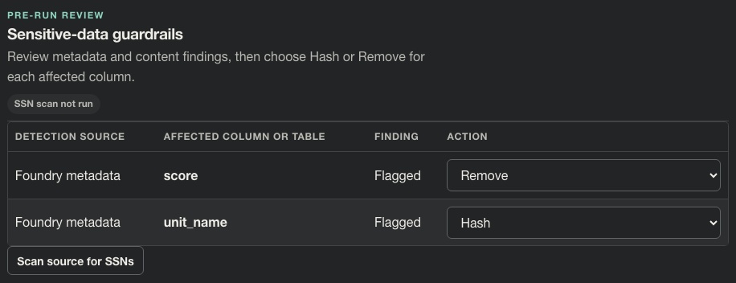

# Story CDO-4559: Choose actions for metadata-tagged columns

[Jira CDO-4559](https://idstjira.socom.mil/jira/browse/CDO-4559) · [Epic CDO-4551: Sensitive Data Guardrails](CDO-4551-sensitive-data-guardrails-epic.md) · [Issue export](../../artifacts/jira/data-mover-sensitive-data-guardrails-issues.csv)

Reviewed against the current implementation on October 6, 2026.

## User story

As a pipeline owner, I want to choose how Data Mover handles columns tagged as sensitive so I can hash or remove them before transfer.

## What the story delivers

Every column flagged by Foundry metadata gets an action selector with two choices:

- **Hash** replaces each non-null value with an HMAC-SHA-256 digest.
- **Remove** drops the column from the destination schema and every transferred batch.

For PostgreSQL, Remove also drops that column from an existing destination table inside the same transaction as the transfer. This clears the selected column from existing destination rows as well as omitting it from incoming rows. The run account must own the table, and PostgreSQL dependencies that prevent a safe column drop cause the transaction to fail without publishing the transfer.

An unresolved finding blocks a run before destination writes. Selected actions are stored with the pipeline definition and copied into the run review.

## Implementation

The pre-run review keys an action by detector and exact inspected column name, then binds the form value to a hash of the selected source identity. Names with surrounding spaces remain distinct from names without them. Blank names, names over 256 characters, and ASCII control characters cannot be represented by a guardrail decision. When the source changes, stale actions are discarded. The save handler validates and stores the chosen action list in guardrail_actions_json. A saved action remains the pipeline owner's handling policy for that column while it exists in the selected source, even if later metadata no longer flags it or a scan no longer finds a matching value. The worker records such an action as a saved decision and applies it consistently with the preflight schema projection.

If the same column has decisions from multiple detectors, Remove is the effective action. Removing a primary or unique destination key or every source column blocks the run. Before a run is queued, the destination preflight and planned-schema preview use the saved Hash/Remove projection.

## Example

For the synthetic Foundry metadata findings, choose **Hash** for `unit_name` and **Remove** for `score`:

| Detection source | Column | Selected action |
| --- | --- | --- |
| Foundry metadata | score | Remove |
| Foundry metadata | unit_name | Hash |

The UI selection is a review decision, not evidence that a run has happened. Save the pipeline to retain the decision, then run it to apply the transformation.

## Screenshot

Open **Route setup → Target schema & creator → Sensitive-data guardrails** after saving the two choices.

1. The left cells say **Foundry metadata**, tying these choices to metadata findings.
2. The first row's **Action** selector shows **Remove** for `score`.
3. The second row's selector shows **Hash** for `unit_name`. These are saved choices before execution; this panel does not claim they have been applied.

Markers and source data are synthetic. See [capture provenance](../screenshots/stories/README.md) and the [acceptance audit](../plans/open-guardrail-issue-acceptance.md) for persistence, source binding, and enforcement evidence.

## Acceptance criteria and implementation

- Hash and Remove choices are rendered per metadata finding by [pipeline.py](../../app/ui/routes/pipeline.py).
- Actions are validated, source-bound, and saved with the pipeline by [pipeline_preview.py](../../app/ui/routes/pipeline_preview.py) and [pipeline_save.py](../../app/ui/routes/pipeline_save.py).
- Unresolved decisions block the run before destination writes in [transfer_engine.py](../../app/services/transfer_engine.py).

## Related implementation

[Pre-run review](../../app/ui/routes/pipeline.py) · [Preview action validation](../../app/ui/routes/pipeline_preview.py) · [Pipeline save](../../app/ui/routes/pipeline_save.py) · [Transformation engine](../../app/services/transfer_engine.py)

## Related Jira tasks

- [CDO task CDO-4560: Data Mover: Add actions for metadata-tagged columns](https://idstjira.socom.mil/jira/browse/CDO-4560)
- [CDO task CDO-4561: Data Mover: Save metadata guardrail actions](https://idstjira.socom.mil/jira/browse/CDO-4561)
- [CDO task CDO-4562: Data Mover: Validate metadata guardrail actions](https://idstjira.socom.mil/jira/browse/CDO-4562)
