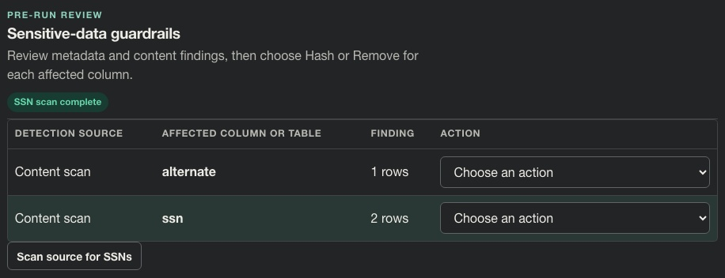

# Story CDO-4563: Detect untagged SSNs in source data

[Jira CDO-4563](https://idstjira.socom.mil/jira/browse/CDO-4563) · [Epic CDO-4551: Sensitive Data Guardrails](CDO-4551-sensitive-data-guardrails-epic.md) · [Issue export](../../artifacts/jira/data-mover-sensitive-data-guardrails-issues.csv)

Reviewed against the current implementation on October 6, 2026.

## User story

As a pipeline owner, I want Data Mover to detect SSNs in columns that lack sensitivity metadata so untagged sensitive data is still identified.

## What the story delivers

The owner can request a pre-run SSN scan for the selected source. Data Mover checks values in bounded batches and reports each affected column, the detector name, and a match count. It never returns the matched value. During an actual run the worker performs a complete scan again before destination staging, so the run does not depend on a possibly stale preview result.

The current content detector recognizes SSN-shaped patterns only. It is designed so other patterns can be added, but it does not currently identify other classes of sensitive data.

## Implementation

The SSN checker matches supported digit, hyphen, and space forms without returning the matching text. It counts matches by column. Metadata-tagged columns are excluded from the content detector because their sensitivity has already been identified by Foundry metadata.

The preview route binds scan results to the current source identity; changing the selected source invalidates results from the prior source. The worker independently scans every extracted batch and accumulates per-column counts while writing source batches into an encrypted, size-limited spool for the pre-write review.

Preview validates generated findings before rendering action controls. A finding whose column name is blank, over 256 characters, or contains ASCII control characters returns safe HTTP 422 feedback with instructions to rename the unsupported column and scan again. New CSV uploads reject control characters in headers during inspection with instructions to rename and re-upload; tab delimiters and quoted multiline **cell values** remain supported. Guardrail decisions preserve exact inspected names rather than silently trimming them.

This is a pattern detector, not an authoritative determination that an identifier is valid or belongs to a person.

## Example

The synthetic CSV has 1,002 rows and three columns: `id`, `ssn`, and `alternate`. The first 1,000 rows have no matches; only the final two rows contain SSN-shaped values. The review shows counts and column names only:

| Detection source | Affected column | Finding |
| --- | --- | --- |
| Content scan | alternate | 1 matching row |
| Content scan | ssn | 2 matching rows |

The example value is redacted in the schema preview and is not present in the finding or run log.

## Screenshot

Open **Route setup → Target schema & creator → Sensitive-data guardrails**, then choose **Scan source for SSNs**.

1. The green **SSN scan complete** badge at the top confirms the preview scan finished.
2. The left cells say **Content scan**. The middle **Finding** cells show `alternate` with **1 rows** and `ssn` with **2 rows** (the UI's current labels).
3. The right selectors still say **Choose an action**. Detection has finished; decisions remain unresolved.

This is a preview scan of a synthetic CSV, not an applied transformation. The worker's independent scan and 1,002-row total appear in the [enforcement story](CDO-4571-apply-guardrail-actions-before-destination-writes.md#screenshots). See [capture provenance](../screenshots/stories/README.md) and the [acceptance audit](../plans/open-guardrail-issue-acceptance.md).

## Acceptance criteria and implementation

- SSN checks count matches without retaining source text in [guardrails.py](../../app/domain/pipelines/guardrails.py).
- The catalog scan reads the selected source in bounded batches and returns counts only in [catalogs.py](../../app/services/catalogs.py).
- The review identifies the content detector and affected column in [pipeline.py](../../app/ui/routes/pipeline.py).
- The actual run repeats the scan across extracted batches before destination staging in [transfer_engine.py](../../app/services/transfer_engine.py).

## Related implementation

[Guardrail domain](../../app/domain/pipelines/guardrails.py) · [Catalog scan](../../app/services/catalogs.py) · [Preview scan route](../../app/ui/routes/pipeline_preview.py) · [Transfer engine](../../app/services/transfer_engine.py)

## Related Jira tasks

- [CDO task CDO-4564: Data Mover: Implement SSN content detection](https://idstjira.socom.mil/jira/browse/CDO-4564)
- [CDO task CDO-4565: Data Mover: Scan source data before destination writes](https://idstjira.socom.mil/jira/browse/CDO-4565)
- [CDO task CDO-4566: Data Mover: Return safe content detection findings](https://idstjira.socom.mil/jira/browse/CDO-4566)
