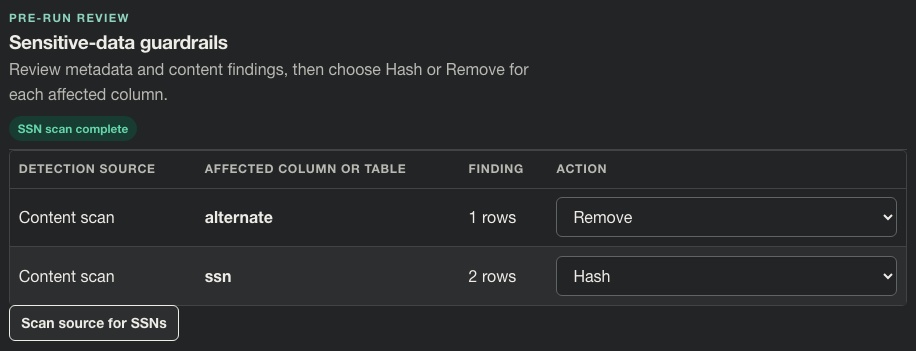
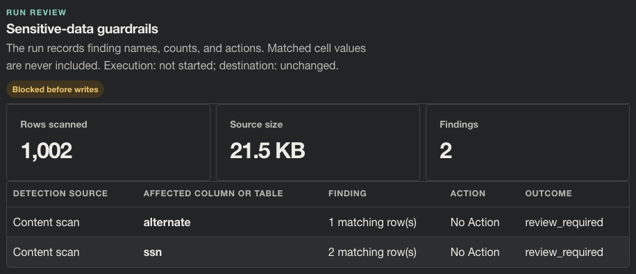

# Story CDO-4567: Choose actions for algorithm-detected columns

[Jira CDO-4567](https://idstjira.socom.mil/jira/browse/CDO-4567) · [Epic CDO-4551: Sensitive Data Guardrails](CDO-4551-sensitive-data-guardrails-epic.md) · [Issue export](../../artifacts/jira/data-mover-sensitive-data-guardrails-issues.csv)

Reviewed against the current implementation on October 6, 2026.

## User story

As a pipeline owner, I want to choose how Data Mover handles columns flagged by content detectors so I can hash or remove them before transfer.

## What the story delivers

A content finding is shown with its detector, column, and count, then receives the same Hash/Remove decision control as a metadata finding. The finding does not show a matched cell value. A run with an unresolved content finding stops before destination writes.

## Implementation

The scan result is validated as a value-free summary and tied to the currently selected source. A generated content finding with an unsupported column name returns safe preview feedback instead of an unhandled rendering error; decisions use exact inspected names, including surrounding spaces. The pipeline preview can retain the owner’s choice for that detector-and-column pair. On a run, the worker scans the actual extracted batches again, resolves each current finding against the saved actions, and blocks if any finding remains unresolved. A saved action also remains active for its column while that column exists in the selected source, even if the latest scan has no match. Destination preflight projects that saved policy too. The shared batch transformation path applies the decision in either case.

The current detector identifier is ssn. The finding and action format permits additional detector implementations without exposing their matched values.

## Example

For the synthetic CSV findings, save **Hash** for `ssn` and **Remove** for `alternate`:

| Detector | Column | Count | Saved action |
| --- | --- | ---: | --- |
| Content scan (SSN) | alternate | 1 matching row | Remove |
| Content scan (SSN) | ssn | 2 matching rows | Hash |

These are selected policies. A successful run later records `applied`; a failed preparation retains `selected`, as shown in the [recording story](CDO-4575-record-guardrail-findings-and-decisions.md#screenshots).

If the owner does not choose an action, the run records the finding as needing review and blocks before destination writes.

## Screenshots

**Saved decisions.** Open **Route setup → Target schema & creator → Sensitive-data guardrails** and repeat the preview scan after saving the choices.

1. **Content scan**, on the left, distinguishes these findings from metadata findings.
2. The `alternate` row pairs **1 rows** with **Remove**; the `ssn` row pairs **2 rows** with **Hash**.
3. The selectors show the saved decisions. This pre-run panel has no applied outcome; see the successful run in [CDO-4571](CDO-4571-apply-guardrail-actions-before-destination-writes.md#screenshots).

**Unresolved decisions.** The same source was first submitted with neither action chosen. Open **Live transfer → Run schema & row counts** for that earlier run.

1. **Rows scanned: 1,002** shows that the worker found the late matches during its full scan.
2. The bottom rows show **No Action** and `review_required` for both columns.
3. **Blocked before writes** and **destination: unchanged** show the result of leaving decisions unresolved. Unlike the table-level block, extraction was necessary to detect these findings.

Both images use the synthetic CSV described in [capture provenance](../screenshots/stories/README.md). The [acceptance audit](../plans/open-guardrail-issue-acceptance.md) covers saved policies, repeat scans, and the absence of destination writes on unresolved findings.

## Acceptance criteria and implementation

- Content scan findings show their detector and column while omitting cell values in [guardrails.py](../../app/domain/pipelines/guardrails.py) and [pipeline.py](../../app/ui/routes/pipeline.py).
- The preview validates source-bound findings and actions in [pipeline_preview.py](../../app/ui/routes/pipeline_preview.py).
- Missing decisions block before staging; resolved actions are applied by [transfer_engine.py](../../app/services/transfer_engine.py).

## Related implementation

[Guardrail domain](../../app/domain/pipelines/guardrails.py) · [Preview scan and actions](../../app/ui/routes/pipeline_preview.py) · [Pre-run review](../../app/ui/routes/pipeline.py) · [Transfer engine](../../app/services/transfer_engine.py)

## Related Jira tasks

- [CDO task CDO-4568: Data Mover: Add actions for content-detected columns](https://idstjira.socom.mil/jira/browse/CDO-4568)
- [CDO task CDO-4569: Data Mover: Save content guardrail actions](https://idstjira.socom.mil/jira/browse/CDO-4569)
- [CDO task CDO-4570: Data Mover: Require resolution for content findings](https://idstjira.socom.mil/jira/browse/CDO-4570)
