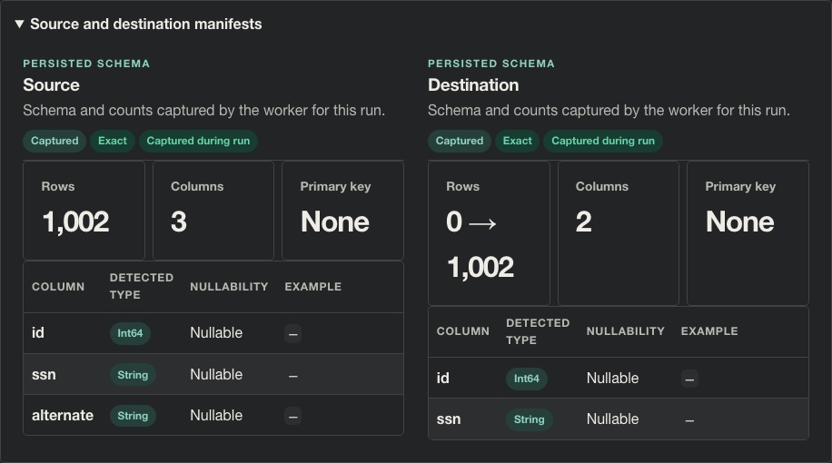

# Story CDO-4571: Apply guardrail actions before destination writes

[Jira CDO-4571](https://idstjira.socom.mil/jira/browse/CDO-4571) · [Epic CDO-4551: Sensitive Data Guardrails](CDO-4551-sensitive-data-guardrails-epic.md) · [Issue export](../../artifacts/jira/data-mover-sensitive-data-guardrails-issues.csv)

Reviewed against the current implementation on October 6, 2026.

## User story

As a pipeline owner, I want Data Mover to enforce my selected actions consistently so sensitive columns are handled before transferred data reaches its destination.

## What the story delivers

The worker scans the full source and resolves all findings before it creates a destination write session. If the scan finds an unresolved column or a guardrail rule cannot be safely applied, the run blocks before writes. Otherwise, each batch is transformed before the destination receives it:

- Hash retains the column but replaces every non-null value with a keyed HMAC-SHA-256 digest. Nulls remain null and the transformed schema uses a string type.
- Remove drops the column from the transformed schema and every batch.

## Implementation

The worker extracts bounded batches, checks schema consistency, scans them for SSN patterns, and stores them in a bounded AES-GCM encrypted spool. Once the full scan is complete, it resolves findings against saved pipeline actions and applies saved column policies to columns that remain in the selected source. A missing action for a current finding blocks the run before destination staging. The worker then reads the reviewed batches, casts configured columns, transforms guarded columns, and writes those transformed batches.

The HMAC key is derived from the active API-token encryption key and scoped to the user and pipeline. Digests are deterministic for the same value, column, user, pipeline, and active key; rotating the active key changes future digests. Remove cannot drop a required destination key, and a run cannot remove every source column. Run submission projects saved actions into the destination preflight and schema preview, so a destination that only accepts the post-Remove schema can be selected.

Preflight uses saved policies for columns still present even when current metadata or scan results no longer flag them. It does not repeat the worker's content scan. Action lookup preserves exact inspected column names: `ssn` and ` ssn ` are distinct columns, so a choice cannot silently bind to the wrong one.

For an existing PostgreSQL target, Remove transactionally drops the selected column from the live table before loading transformed rows. Existing values in that column are removed too. The run account must own the table. Remove is blocked for a column in an existing primary or unique destination key. A dependent database object that prevents the column drop causes the transaction to roll back; the run does not publish partial changes.

## Example

The synthetic CSV has `id`, `ssn`, and `alternate`. Choose Hash for `ssn` and Remove for `alternate`:

| Before write | Destination |
| --- | --- |
| id: source identifier | id: unchanged |
| ssn: source value, redacted in review | ssn: keyed 64-character HMAC digest; nulls preserved |
| alternate: source column | Column absent |

The images below show the persisted applied outcomes and schema removal. They do not expose row values or a digest. Automated acceptance checks verify actual HMAC output, null preservation, and removal from every batch. For an existing PostgreSQL table, prior values in the removed column are also removed by the transaction; other existing rows remain according to the write mode. That existing-table behavior is covered by PostgreSQL integration tests, rather than this new-target demo.

## Screenshots

**Applied outcomes.** Open **Live transfer → Run schema & row counts → Sensitive-data guardrails** after the successful synthetic transfer.

1. The description says **Execution: completed; destination: committed** and the badge says **Actions applied**.
2. The **Rows scanned** metric is **1,002**. Matches occur only in the final two rows; both findings were resolved before destination staging.
3. The bottom **Action / Outcome** pairs are `alternate`: **Remove / applied** and `ssn`: **Hash / applied**.

**Persisted schema effect.** Expand **Source and destination manifests** immediately below the run review.

1. The **Source** panel shows **Columns: 3** and retains the original `id`, `ssn`, and `alternate` columns for review.
2. The **Destination** panel shows **Columns: 2** and lists only `id` and `ssn`. This is the visible effect of Remove.
3. The destination keeps `ssn` with type **String**. Its applied Hash outcome is shown in the first image; a matching type alone does not demonstrate hashing.

See [capture provenance](../screenshots/stories/README.md) and the [acceptance audit](../plans/open-guardrail-issue-acceptance.md) for the synthetic fixture and automated batch/output checks.

## Acceptance criteria and implementation

- Full scan and unresolved-action validation occur before destination staging in [transfer_engine.py](../../app/services/transfer_engine.py).
- HMAC transformation and column removal are applied to each batch before write_batch in [transfer_engine.py](../../app/services/transfer_engine.py).
- The transformed schema is used to prepare the destination, so removed columns are not created there.
- Saved decisions are included in the pre-run destination schema projection by [pipeline_runs.py](../../app/ui/routes/pipeline_runs.py) and the planned schema preview by [pipeline.py](../../app/ui/routes/pipeline.py). PostgreSQL applies selected column drops in its destination transaction in [postgres.py](../../app/connectors/postgres.py).
- Blocked outcomes identify the reason and are persisted without cell values through [pipeline_runs.py](../../app/services/pipeline_runs.py).

## Related implementation

[Transfer engine](../../app/services/transfer_engine.py) · [Run record service](../../app/services/pipeline_runs.py) · [Run model](../../app/models.py) · [Migration 0021](../../migrations/versions/0021_sensitive_data_guardrails.py)

## Related Jira tasks

- [CDO task CDO-4572: Data Mover: Implement the approved hash transform](https://idstjira.socom.mil/jira/browse/CDO-4572)
- [CDO task CDO-4573: Data Mover: Remove selected columns from transfer data](https://idstjira.socom.mil/jira/browse/CDO-4573)
- [CDO task CDO-4574: Data Mover: Enforce guardrail actions across transfer batches](https://idstjira.socom.mil/jira/browse/CDO-4574)
