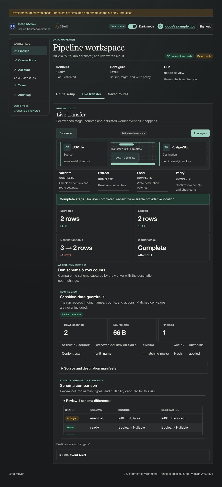

# Story CDO-4571: Apply guardrail actions before destination writes

[Jira CDO-4571](https://idstjira.socom.mil/jira/browse/CDO-4571) · [Epic CDO-4551: Sensitive Data Guardrails](CDO-4551-sensitive-data-guardrails-epic.md) · [Issue export](../../artifacts/jira/data-mover-sensitive-data-guardrails-issues.csv)

## User story

As a pipeline owner, I want Data Mover to enforce my selected actions consistently so sensitive columns are handled before transferred data reaches its destination.

## What the story delivers

The worker scans the full source and resolves all findings before it creates a destination write session. If the scan finds an unresolved column or a guardrail rule cannot be safely applied, the run blocks before writes. Otherwise, each batch is transformed before the destination receives it:

- Hash retains the column but replaces every non-null value with a keyed HMAC-SHA-256 digest. Nulls remain null and the transformed schema uses a string type.
- Remove drops the column from the transformed schema and every batch.

## Implementation

The worker extracts bounded batches, checks schema consistency, scans them for SSN patterns, and stores them in a bounded AES-GCM encrypted spool. Once the full scan is complete, it resolves metadata and content findings against the saved pipeline actions. Only a fully resolved review proceeds to destination staging. The worker then reads the reviewed batches, casts configured columns, transforms guarded columns, and writes those transformed batches.

The HMAC key is derived from the active API-token encryption key and scoped to the user and pipeline. Digests are deterministic for the same value, column, user, pipeline, and active key; rotating the active key changes future digests. Remove cannot drop a required destination key, and a run cannot remove every source column. Run submission projects saved actions into the destination preflight and schema preview, so a destination that only accepts the post-Remove schema can be selected.

For an existing PostgreSQL target, Remove transactionally drops the selected column from the live table before loading transformed rows. Existing values in that column are removed too. The run account must own the table. A dependent database object that prevents the column drop causes the transaction to roll back; the run does not publish partial changes.

## Example

Suppose a source has unit_name and the owner chose Hash:

| Before write | Destination |
| --- | --- |
| unit_name: redacted source value | unit_name: keyed 64-character HMAC digest |

For Remove, the unit_name column is absent from the destination schema and incoming rows. When the PostgreSQL table already exists, its prior unit_name values are removed by the same transaction; other existing rows remain according to the selected write mode. The example output is illustrative; the screenshot verifies that the demo run applied Hash and completed without displaying the source value.

## Screenshot

The isolated demo run extracted and loaded two synthetic rows. Its after-run review shows one content finding, Hash, and an applied outcome.

## Acceptance criteria and implementation

- Full scan and unresolved-action validation occur before destination staging in [transfer_engine.py](../../app/services/transfer_engine.py).
- HMAC transformation and column removal are applied to each batch before write_batch in [transfer_engine.py](../../app/services/transfer_engine.py).
- The transformed schema is used to prepare the destination, so removed columns are not created there.
- Saved decisions are included in the pre-run destination schema projection by [pipeline_runs.py](../../app/ui/routes/pipeline_runs.py) and the planned schema preview by [pipeline.py](../../app/ui/routes/pipeline.py). PostgreSQL applies selected column drops in its destination transaction in [postgres.py](../../app/connectors/postgres.py).
- Blocked outcomes identify the reason and are persisted without cell values through [pipeline_runs.py](../../app/services/pipeline_runs.py).

## Related implementation

[Transfer engine](../../app/services/transfer_engine.py) · [Run record service](../../app/services/pipeline_runs.py) · [Run model](../../app/models.py) · [Migration 0021](../../migrations/versions/0021_sensitive_data_guardrails.py)

## Related Jira tasks

- [CDO task CDO-4572: Data Mover: Implement the approved hash transform](https://idstjira.socom.mil/jira/browse/CDO-4572)
- [CDO task CDO-4573: Data Mover: Remove selected columns from transfer data](https://idstjira.socom.mil/jira/browse/CDO-4573)
- [CDO task CDO-4574: Data Mover: Enforce guardrail actions across transfer batches](https://idstjira.socom.mil/jira/browse/CDO-4574)
