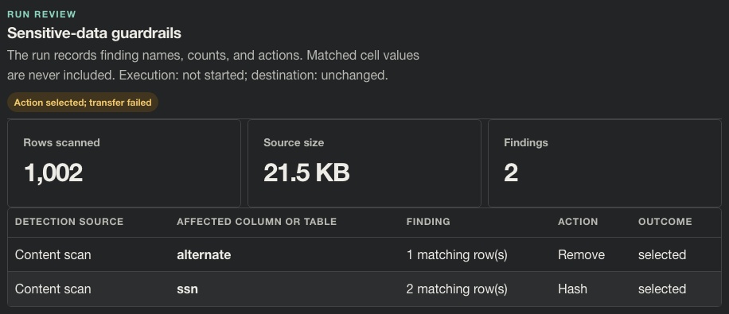
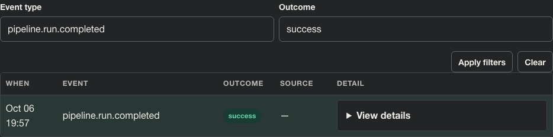

# Story CDO-4575: Record guardrail findings and decisions

[Jira CDO-4575](https://idstjira.socom.mil/jira/browse/CDO-4575) · [Epic CDO-4551: Sensitive Data Guardrails](CDO-4551-sensitive-data-guardrails-epic.md) · [Issue export](../../artifacts/jira/data-mover-sensitive-data-guardrails-issues.csv)

Reviewed against the current implementation on October 6, 2026.

## User story

As a pipeline owner, I want to review which guardrails ran and what actions were applied so I can understand and audit each transfer.

## What the story delivers

Once the worker persists a guardrail review, the run can show whether its scan completed or was blocked, how many rows and bytes were scanned, which detectors flagged which columns or table, the count, the selected and effective actions, and the outcome. A run that fails before reaching guardrail review may have no guardrail document. The record omits matched source values.

The pipeline definition retains the owner’s action choices. The run record captures what the worker actually found and applied for that particular source snapshot. The audit activity list separately records the run event and links it to its pipeline and run identifiers.

## Implementation

PipelineRun.guardrail_json stores a versioned, value-free review document. It contains scan status and totals, findings, selected actions, columns removed or hashed, execution outcome, destination outcome, overall outcome, and a blocked reason where applicable. While the destination is being prepared, selected actions have finding outcome `selected`, overall outcome `pending`, execution outcome `not_started`, and destination outcome `pending`. A terminal failure or cancellation keeps the selected decisions and records whether transformation never started, completed, or was partial, plus whether the destination stayed unchanged, rolled back, or needs reconciliation. Clear reviews keep outcome `clear` and still record the terminal destination state. The successful run transaction records outcome `applied` only after the transformed destination has committed. A completed scan with no findings records `clear`; a blocked run records `blocked`. The run service redacts the document before persistence. Run event messages and summaries also omit matched cell text.

The source manifest records the schema inspected before guardrail transformations and configured type overrides. The destination manifest describes the resulting destination schema. This preserves removed source columns and the original type of a hashed source column for review.

The run review surface displays the persisted findings and outcome. The security audit event includes run identifiers and transfer metadata; detailed guardrail findings are shown in the run review rather than copied into the audit event payload.

## Example

| Detection source | Column | Finding | Action | Outcome |
| --- | --- | --- | --- | --- |
| Content scan | alternate | 1 matching row | Remove | Applied |
| Content scan | ssn | 2 matching rows | Hash | Applied |

If destination preparation fails after an owner selected Hash, the run retains the finding with action Hash and outcome `selected`; the terminal review reports `failed`, `not_started`, and `unchanged`. If a later write is cancelled or fails, the review records the observed execution and destination outcomes, including rollback or reconciliation when applicable. The action becomes `applied` only when the destination run completes successfully.

A blocked run instead records outcome: blocked and a safe explanation, such as an unresolved action or a table-level Foundry marking. Neither record includes the matching value.

## Screenshots

**Successful run review.** Open **Live transfer → Run schema & row counts → Sensitive-data guardrails**.

1. The description records **Execution: completed; destination: committed**.
2. **Rows scanned: 1,002** and **Findings: 2** are scan totals, not displayed source values.
3. The **Outcome** column says `applied` for both the **Remove** and **Hash** decisions.

**Failed preparation.** The same synthetic source and choices were submitted to a destination configured in the capture fixture to fail during preparation.

1. The yellow badge says **Action selected; transfer failed**.
2. The description says **Execution: not started; destination: unchanged**. The complete scan had finished, but batch transformation had not begun.
3. The **Outcome** cells remain `selected`, demonstrating why saved choices must not be reported as applied on a failed transfer.

**Separate security audit event.** Open **Audit log**, set **Event type** to `pipeline.run.completed` and **Outcome** to `success`, then choose **Apply filters**.

1. The two filter fields at the top identify the event and outcome being shown.
2. The **Event** cell says `pipeline.run.completed`; the green **Outcome** badge says `success`.
3. **View details**, on the right, opens transfer metadata, including `pipeline_id`, `run_id`, `run_status`, and `loaded_rows`. Long payloads scroll horizontally in this UI; the capture shows the collapsed summary so no payload is clipped. The complete synthetic payload is available as [audit-example.json](../screenshots/stories/audit-example.json).

The audit event is separate from the detailed guardrail review in the first two images. All captures use a fresh synthetic workspace; see [capture provenance](../screenshots/stories/README.md) and the [acceptance audit](../plans/open-guardrail-issue-acceptance.md).

## Acceptance criteria and implementation

- Run-level guardrail data includes findings, selected actions, scan totals, removed/hashed columns, and completion outcome in [transfer_engine.py](../../app/services/transfer_engine.py).
- The run service redacts and persists review data in [pipeline_runs.py](../../app/services/pipeline_runs.py); the schema fields are added in [migration 0021](../../migrations/versions/0021_sensitive_data_guardrails.py).
- The source manifest captures the pre-transform source schema; the destination manifest captures the projected result.
- The run review displays counts and actions without cell values in [pipeline.py](../../app/ui/routes/pipeline.py).
- The audit event associates the completed run with the pipeline and run identifiers; detailed guardrail findings remain on the run review.

## Related implementation

[Pipeline run service](../../app/services/pipeline_runs.py) · [Transfer engine](../../app/services/transfer_engine.py) · [Run review UI](../../app/ui/routes/pipeline.py) · [Models](../../app/models.py) · [Migration 0021](../../migrations/versions/0021_sensitive_data_guardrails.py)

## Related Jira tasks

- [CDO task CDO-4576: Data Mover: Store guardrail findings and actions in run records](https://idstjira.socom.mil/jira/browse/CDO-4576)
- [CDO task CDO-4577: Data Mover: Show guardrail outcomes in run details](https://idstjira.socom.mil/jira/browse/CDO-4577)
- [CDO task CDO-4578: Data Mover: Keep sensitive values out of guardrail logs](https://idstjira.socom.mil/jira/browse/CDO-4578)
